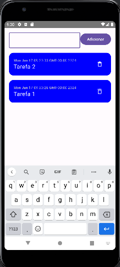

# GERENCIADOR DE TAREFAS


## Descrição

**é um aplicativo desenvolvido para auxiliar a gestão de tarefas do dia a dia.

## Funcionalidades

- Adicionar Tarefas
- Visualizar Tarefas
- Excluir Tarefas
  

## Capturas de Tela





## Como Utilizar

1. **Inicializando o Aplicativo**: Abra o aplicativo.
2. **Adicionar Tarefas** : clique no botão adicionar para criar uma nova tarefa
3. **Visualizar Tarefas** : as tarefas serão apresentadas em ordem cronológica
4. **Excluir Tarefas** : clique no ícone de lixeira


## Instalação

1. **Clone o repositório**:
    ```sh
    git clone https://github.com/ThiagoAlbernaz/TrabalhoMobileSegunda.git
    ```
2. **Abra no Android Studio**:
   - Vá em `File > Open` e selecione o diretório do projeto.
3. **Construa o Projeto**:
   - Clique em `Build > Make Project` ou pressione `Ctrl+F9`.
4. **Execute o Aplicativo**:
   - Conecte um dispositivo Android ou use um emulador.
   - Clique em `Run > Run 'app'` ou pressione `Shift+F10`.

## Integrantes

- **Nome dos Desenvolvedores**:
- Thiago Albernaz
- Alexandre Khalil
- Davi Eloi
- Philipe Tiago
